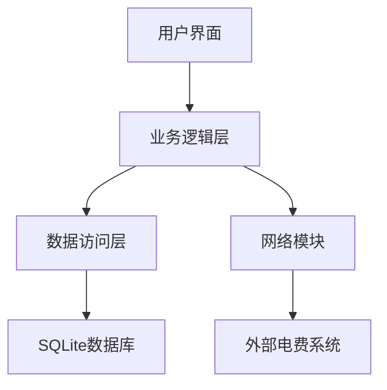

# 惠电宿舍电费充值管理系统

## 项目概述

**惠电宿舍电费充值管理系统**是一个基于Qt 6.5.3开发的桌面应用程序，旨在为高校宿舍提供便捷的电费管理解决方案。系统分为学生端和管理员端，实现了电费查询、充值、记录管理等功能。

## 技术栈

- **开发框架**：Qt 6.5.3
- **编程语言**：C++
- **数据库**：SQLite
- **UI组件**：Qt Widgets
- **图表库**：Qt Charts
- **网络模块**：Qt Network（网页爬取）

## 系统架构

### 整体架构

### 模块划分

| 模块 | 功能描述 | 文件位置 |
|------|----------|----------|
| 登录模块 | 用户认证和权限管理 | loding_wd.cpp/h |
| 学生面板 | 学生功能界面 | studentpanel.cpp/h |
| 管理员面板 | 管理员功能界面 | adminpanel.cpp/h |
| 数据库管理 | 数据存储和操作 | databasemanager.cpp/h |
| 电费解析 | 网页数据爬取和解析 | electricityparser.cpp/h |
| 电费查询 | 网页电费查询界面 | electricityquery.cpp/h |
| 主窗口 | 应用程序入口 | mainwindow.cpp/h |
| 学生信息 | 学生信息管理 | studentinfo.cpp/h |

## 核心功能

### 学生端功能

1. **电费余额查询**
   - 实时显示当前余额
   - 余额不足时自动提醒

2. **电费充值**
   - 支持自定义充值金额
   - 充值记录自动保存

3. **用电记录查询**
   - 查看历史用电记录
   - 按时间排序显示

4. **充值记录查询**
   - 查看历史充值记录
   - 显示充值金额和时间

5. **网页电费查询**
   - 自动从网页获取最新电费数据
   - 记录查询时间和度数变化

6. **数据可视化**
   - 电费变化趋势图表
   - 度数变化趋势图表

### 管理员端功能

1. **学生信息管理**
   - 添加、编辑、删除学生信息
   - 为学生进行电费充值

2. **宿舍信息管理**
   - 添加、编辑、删除宿舍信息
   - 查看宿舍剩余度数

3. **电费扣费**
   - 为宿舍进行电费扣费
   - 扣费记录自动保存

4. **数据统计**
   - 学生总数统计
   - 总余额统计
   - 总充值金额统计

5. **充值记录管理**
   - 查看所有充值记录
   - 按条件筛选记录

6. **用电记录管理**
   - 查看所有用电记录
   - 按条件筛选记录

7. **数据可视化**
   - 充值趋势图表
   - 用电趋势图表

## 数据库设计

### 表结构

#### 用户表 (users)
| 字段名 | 数据类型 | 描述 |
|--------|----------|------|
| id | INTEGER | 主键 |
| username | TEXT | 用户名 |
| password | TEXT | 密码（加密） |
| name | TEXT | 姓名 |
| student_id | TEXT | 学号 |
| dormitory | TEXT | 宿舍号 |
| balance | REAL | 余额 |
| role | INTEGER | 角色（0=管理员，1=学生） |

#### 宿舍表 (dormitories)
| 字段名 | 数据类型 | 描述 |
|--------|----------|------|
| id | INTEGER | 主键 |
| number | TEXT | 宿舍号 |
| building | TEXT | 楼栋 |
| floor | INTEGER | 楼层 |
| remaining_kwh | REAL | 剩余度数 |
| last_reading | REAL | 最后读数 |
| last_kwh_update | TEXT | 最后度数更新时间 |

#### 充值记录表 (recharge_records)
| 字段名 | 数据类型 | 描述 |
|--------|----------|------|
| id | INTEGER | 主键 |
| student_id | TEXT | 学号 |
| dormitory | TEXT | 宿舍号 |
| amount | REAL | 充值金额 |
| balance_after | REAL | 充值后余额 |
| recharge_time | TEXT | 充值时间 |
| operator_name | TEXT | 操作人 |

#### 用电记录表 (electricity_records)
| 字段名 | 数据类型 | 描述 |
|--------|----------|------|
| id | INTEGER | 主键 |
| user_id | INTEGER | 用户ID |
| dormitory | TEXT | 宿舍号 |
| usage | REAL | 用电量 |
| cost | REAL | 费用 |
| record_time | TEXT | 记录时间 |
| remark | TEXT | 备注 |

#### 电费变动记录表 (electricity_change_records)
| 字段名 | 数据类型 | 描述 |
|--------|----------|------|
| id | INTEGER | 主键 |
| user_id | INTEGER | 用户ID |
| change_type | TEXT | 变动类型 |
| amount | REAL | 变动金额 |
| balance_before | REAL | 变动前余额 |
| balance_after | REAL | 变动后余额 |
| dormitory | TEXT | 宿舍号 |
| operator_name | TEXT | 操作人 |
| change_time | TEXT | 变动时间 |
| remark | TEXT | 备注 |

#### 度数变动记录表 (kwh_change_records)
| 字段名 | 数据类型 | 描述 |
|--------|----------|------|
| id | INTEGER | 主键 |
| dormitory | TEXT | 宿舍号 |
| change_type | TEXT | 变动类型 |
| kwh_change | REAL | 变动度数 |
| kwh_before | REAL | 变动前度数 |
| kwh_after | REAL | 变动后度数 |
| operator_name | TEXT | 操作人 |
| change_time | TEXT | 变动时间 |
| query_url | TEXT | 查询网址 |

## 界面设计

### 登录界面
- 用户名和密码输入
- 登录按钮
- 测试账号提示

### 学生界面
- 顶部用户信息栏
- 余额显示
- 功能标签页：
  - 余额查询
  - 使用记录
  - 充值记录
  - 金额变动记录
  - 度数变动记录

### 管理员界面
- 顶部管理员信息栏
- 系统统计卡片
- 功能标签页：
  - 系统统计
  - 学生管理
  - 宿舍管理
  - 充值记录
  - 用电记录

## 技术亮点

1. **网页电费查询**：实现了自动从网页获取电费数据的功能，提高了数据的准确性和及时性

2. **数据可视化**：使用Qt Charts实现了电费和度数变化的趋势图表，直观展示数据

3. **界面美化**：通过QSS样式表实现了现代化的界面设计，提升用户体验

4. **数据库迁移**：实现了数据库结构的自动更新，确保系统的兼容性

5. **安全性**：实现了密码加密存储和用户权限控制

6. **完整性**：从前端界面到后端数据库，实现了完整的系统功能

## 系统部署

### 部署步骤

1. **编译项目**：使用Qt Creator编译Release版本
2. **运行封装脚本**：执行`build_release.bat`脚本
3. **部署文件**：脚本会自动生成包含所有依赖的部署目录
4. **启动系统**：双击`启动惠电系统.bat`启动程序

### 系统要求

- Windows 10 或更高版本
- 已包含所有必要的运行库

## 测试账号

| 角色 | 用户名 | 密码 |
|------|--------|------|
| 学生 | 2021001 | 123456 |
| 管理员 | admin | admin123 |

## 未来规划

1. **移动端支持**：开发移动应用，实现随时随地查询和充值

2. **云端数据同步**：实现数据云端存储，确保数据安全和备份

3. **智能电费预测**：基于历史数据预测电费使用情况，提供节能建议

4. **多语言支持**：添加英文界面，支持国际化

5. **支付集成**：集成在线支付功能，支持微信、支付宝等支付方式

## 总结

惠电宿舍电费充值管理系统是一个功能完整、界面美观、技术先进的电费管理解决方案。系统通过现代化的技术手段，解决了传统电费管理中的诸多问题，为宿舍管理提供了便捷、高效的工具。

---

**版本信息**
- 版本：1.0.0
- 开发日期：2026年3月
- 开发环境：Qt 6.5.3 MinGW 64-bit
- 数据库：SQLite
